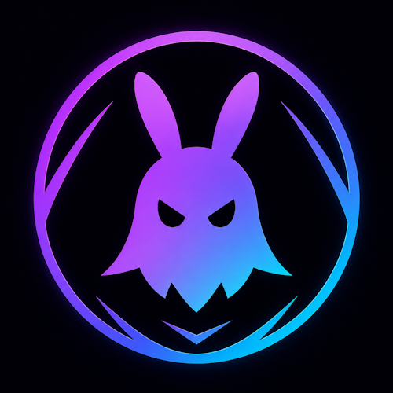

<p align="center">
  
</p>

<h1 align="center">GHXST Lens</h1>

<p align="center">
  <strong>Low-latency Android camera source for OBS Studio.</strong>
</p>

<p align="center">
  Turn an Android phone into a clean native OBS camera source over LAN — with very low CPU usage, native OBS integration, and no browser-source bloat.
</p>

<p align="center">
  <a href="https://github.com/ghxstlab/ghxst-lens/releases/tag/beta-0.5.0-beta.1">
    
  </a>
  
  
  
</p>

<p align="center">
  <a href="#features">Features</a> •
  <a href="#downloads">Downloads</a> •
  <a href="#quick-start">Quick Start</a> •
  <a href="#performance">Performance</a> •
  <a href="#roadmap">Roadmap</a>
</p>

---

## What is GHXST Lens?

**GHXST Lens** is a low-latency Android camera streaming system for **OBS Studio**.

It lets an Android phone act as a native OBS camera source over your local network using:

```text
Android Camera2 + MediaCodec
→ TCP LAN stream
→ Native OBS plugin
→ Direct GPU decode/render path
→ OBS scene
